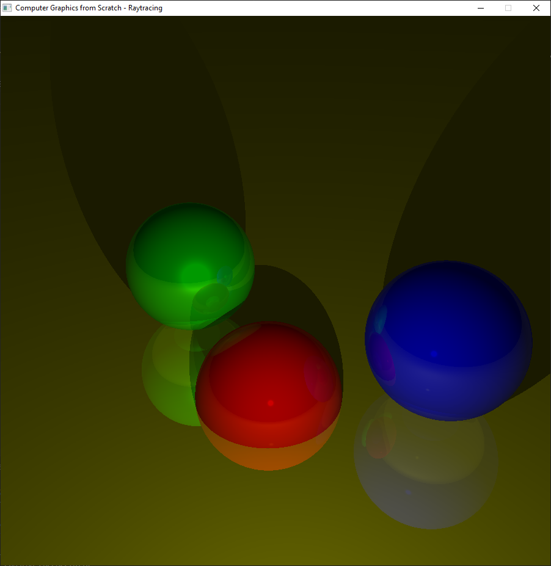
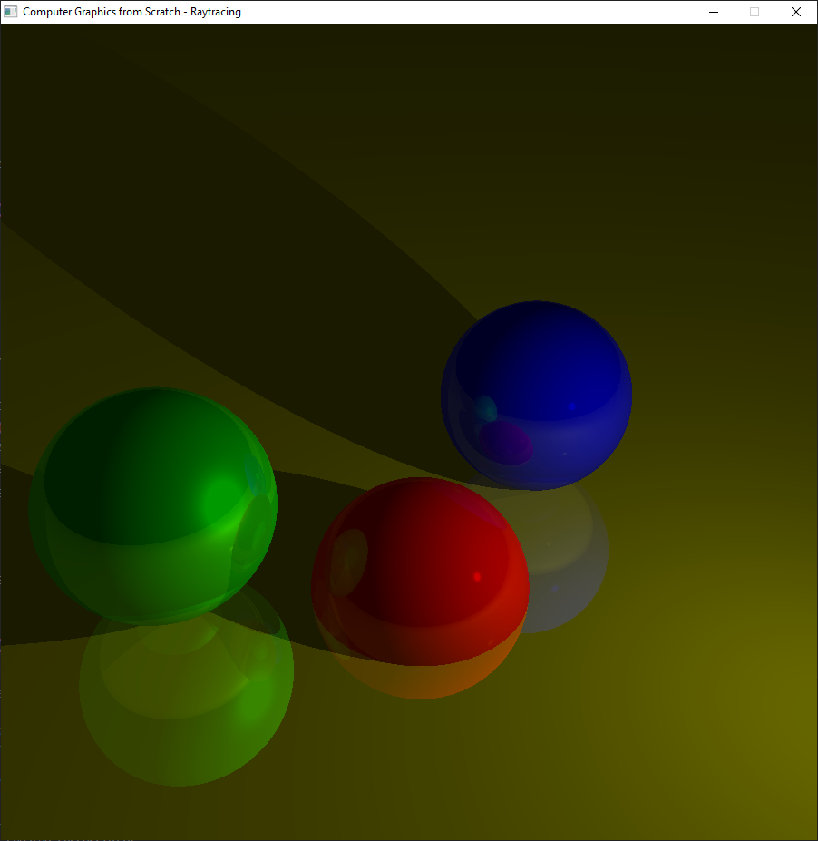
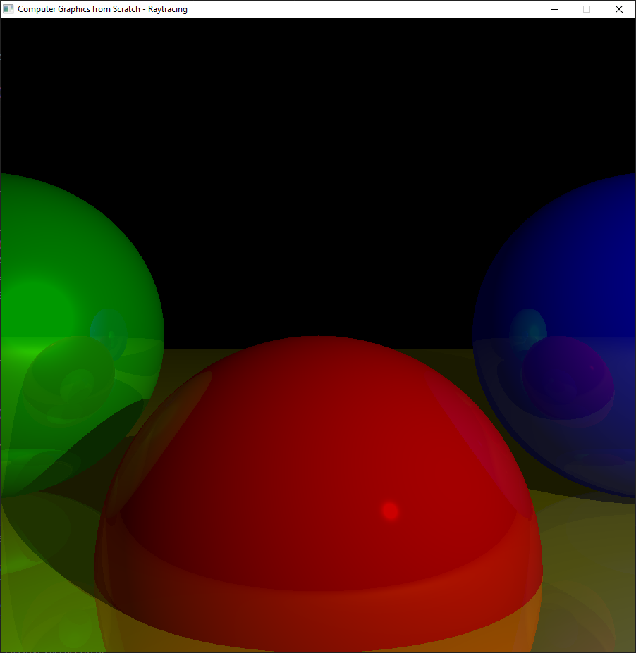

# Computer graphics from scratch

Implementation of the two renderers described in the book "Computer Graphics from Scratch by Gabriel Gambetta".

For compiling you need CMake, a C99 compiler and Raylib.

Some screenshots:

